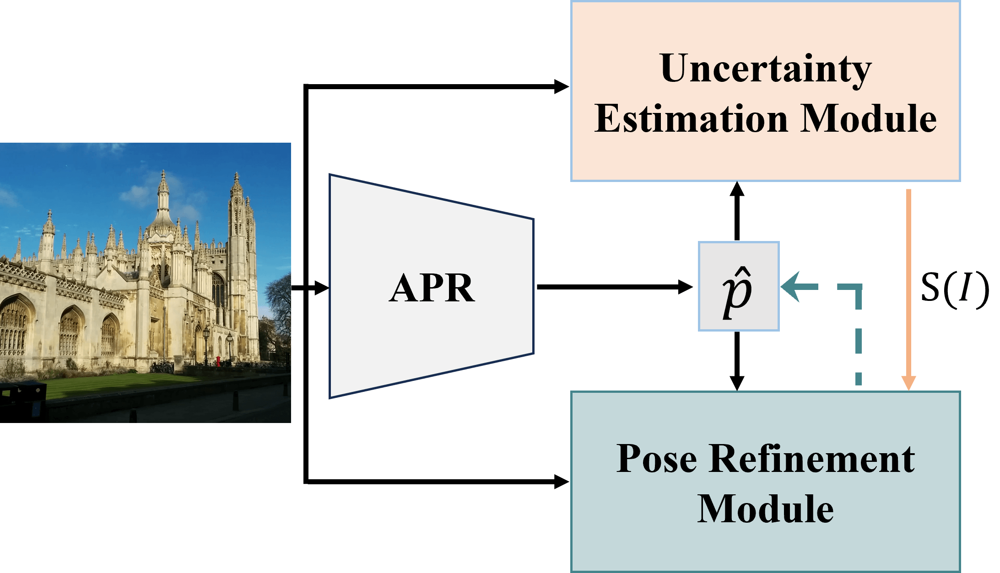
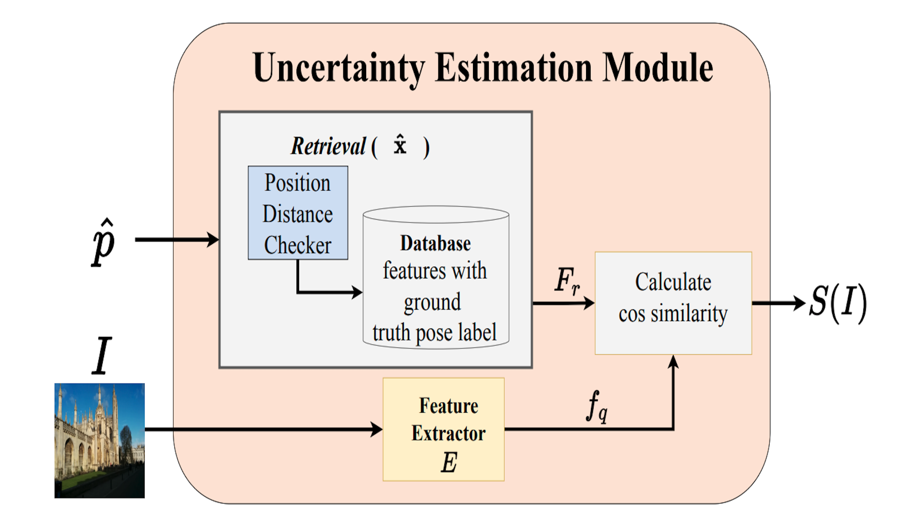

# HR-APR: APR-agnostic Framework with Uncertainty Estimation and Hierarchical Refinement for Camera Relocalisation
This is the official repo of paper "HR-APR: APR-agnostic Framework with Uncertainty Estimation and Hierarchical Refinement for Camera Relocalisation"

### [Homepage](https://lck666666.github.io/research/HR-APR/index.html) | [Paper](https://arxiv.org/pdf/2402.14371.pdf)

**HR-APR: APR-agnostic Framework with Uncertainty Estimation and Hierarchical Refinement for Camera Relocalisation** <br>
[Changkun Liu](https://lck666666.github.io)<sup>1</sup>, [Shuai Chen](https://chenusc11.github.io/)<sup>3</sup>, [Yukun Zhao](https://scholar.google.com/citations?view_op=list_works&hl=zh-CN&user=NcLael4AAAAJ)<sup>2</sup>,
[Huajian Huang](https://huajianup.github.io/)<sup>1</sup>, [Victor Prisacariu](https://www.robots.ox.ac.uk/~victor/)<sup>3</sup> and [Tristan Braud](https://braudt.people.ust.hk/index.html)<sup>1,2</sup> <br>
HKUST CSE<sup>1</sup>, HKUST ISD<sup>2</sup>, Active Vision Lab, University of Oxford<sup>3</sup> <br>
International Conference on Robotics and Automation (ICRA) 2024<br>


## Usage
```
git clone https://github.com/lck666666/HR-APR.git
cd HR-APR
pip install json numpy matplotlib
```

## Show HR-APR results in the paper
We already prepared the `txt` results files for three APRs:`DFNet, MS-Transformer, PoseNet` in `APR/7Scenes` and `APR/Cambridge`. we provide `scene_test_gt.txt, scene_train_gt.txt, scene_predict.txt, scene_Nefes_N.txt`, where `N=10,30,50` presents running the refinement process for `N` iterations.
```
cd uncertainty_module
python hr_apr_7s.py --apr DFNet --scene fire --gamma 0.95
python hr_apr_cam.py --apr DFNet --scene KingsCollege --gamma 0.96
```

## Visualization
You can generate the Fig.4 in the main paper by executing
```
cd visualization
python errorChange7s.py --apr DFNet --gamma 0.95
python errorChangeCam.py --apr DFNet --gamma 0.95
```
You can generate the Fig.5 in the main paper by executing
```
cd visualization
python plotSimiErrorRatio.py --apr DFNet
python plotSimiErrorRot --apr DFNet
python plotSimiErrorTrans --apr DFNet
```


## Try the whole pipeline 
We release the uncertainty module and visualization code in this repo. For feature extractor depicted in the paper, you can check the readme of [PoseNet-Pytorch](https://github.com/youngguncho/PoseNet-Pytorch) and use the code in our feature_extractor, then generate `.npy`feature for each image. To generate the same files in `APR/simi_ranking`, you can execute 
```
python cal_7s_simi.py --apr DFNet --scene fire
python cal_cam_simi.py --apr DFNet --scene KingsCollege
```
To get Nefes refinement predictions of each APR, you can check the CVPR2024 [paper](https://github.com/ActiveVisionLab/NeFeS).


## Acknowledgement
Part of our Extractor implementation is referenced from the reproduced PoseNet code [here](https://github.com/youngguncho/PoseNet-Pytorch?tab=readme-ov-file). Thanks [@youngguncho](https://github.com/youngguncho) for the excellent work!

## Citation
Please cite our paper and star this repo if you find our work helpful. Thanks!
```
@inproceedings{liu2024hrapr,
title = {HR-APR: APR-agnostic Framework with Uncertainty Estimation and Hierarchical Refinement for Camera Relocalisation},
author={Changkun Liu and Shuai Chen and Yukun Zhao and Huajian Huang and Victor Prisacariu and Tristan Braud},
booktitle = {International Conference on Robotics and Automation (ICRA)},
year = {2024},
organization={IEEE}
}
```
If you are also interested in the pose refinement module, please cite
```
@article{chen2023refinement,
  title={Refinement for Absolute Pose Regression with Neural Feature Synthesis},
  author={Chen, Shuai and Bhalgat, Yash and Li, Xinghui and Bian, Jiawang and Li, Kejie and Wang, Zirui and Prisacariu, Victor Adrian},
  journal={arXiv preprint arXiv:2303.10087},
  year={2023}
}
```
